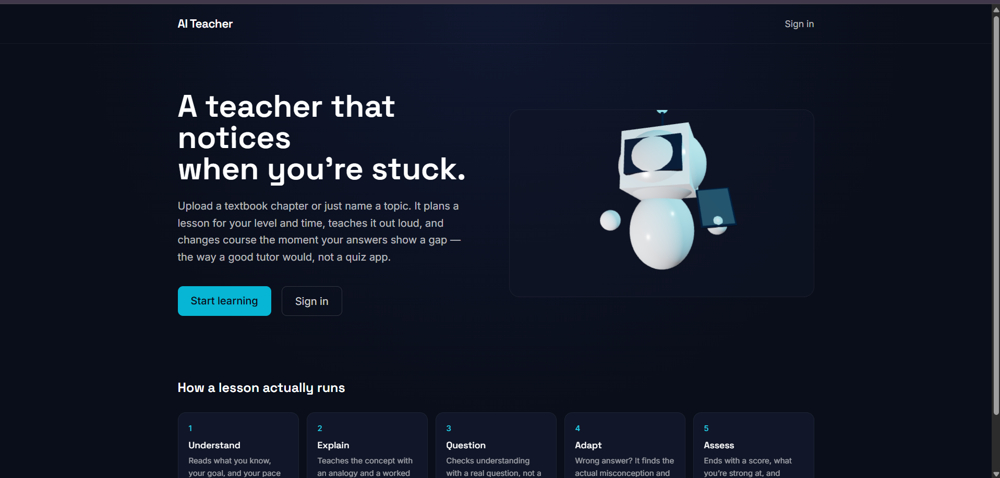
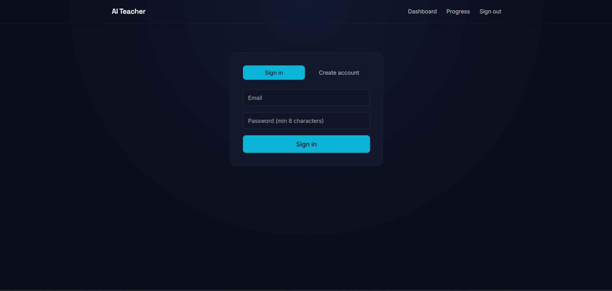
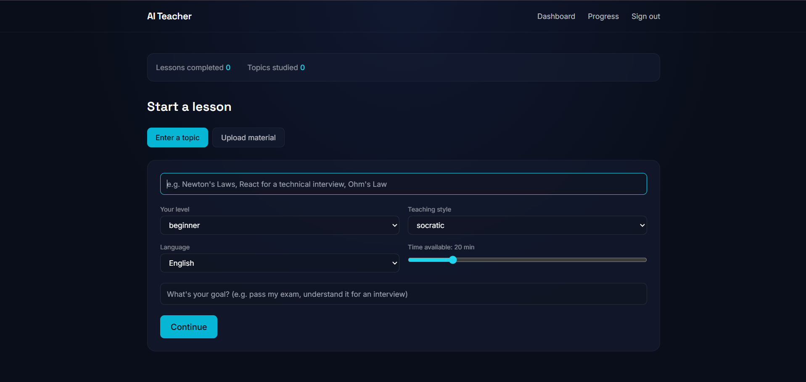
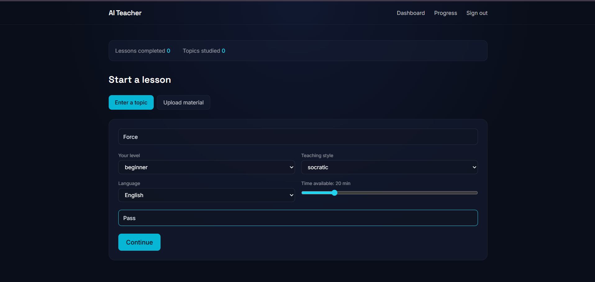
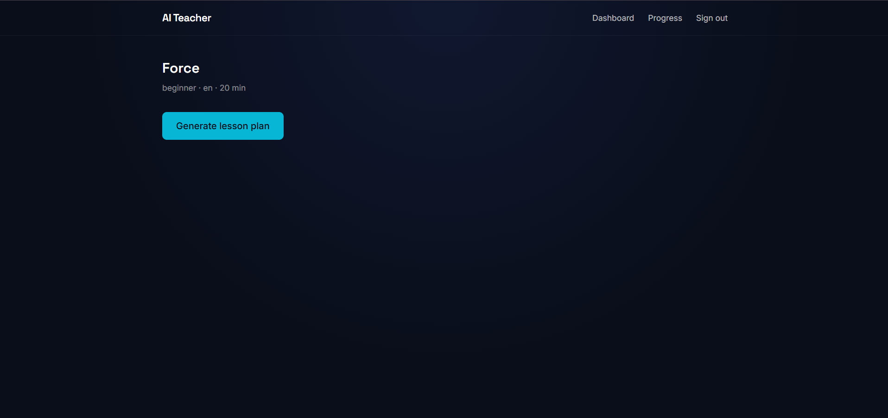
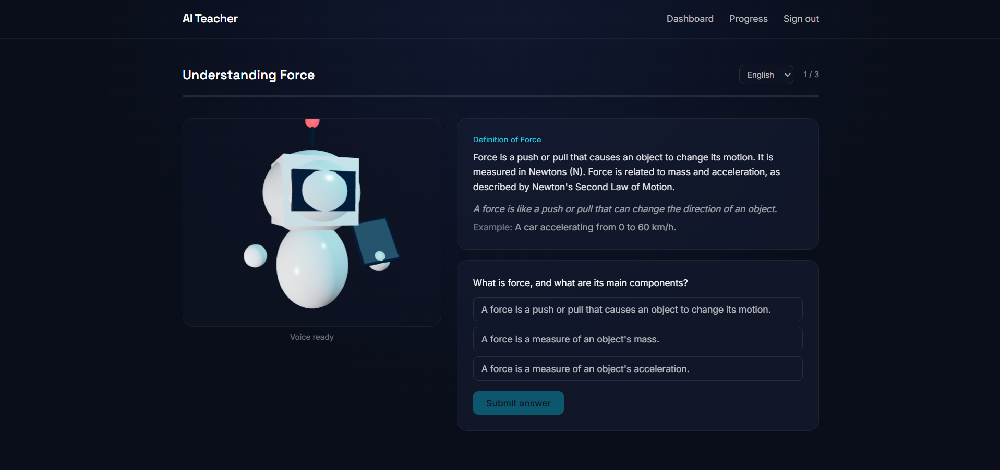
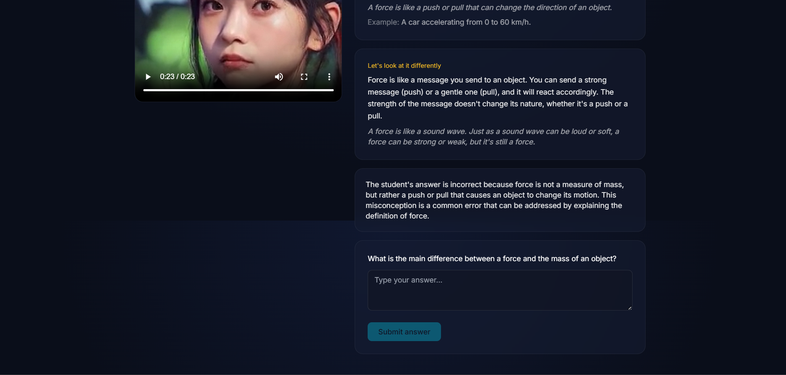
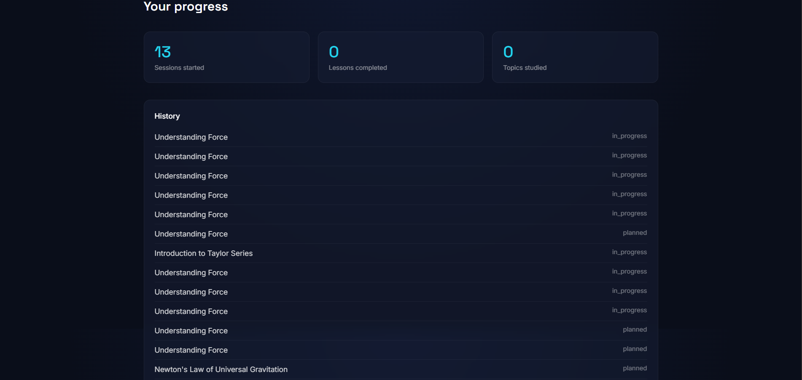

# \# AI Teacher

# 

# A personalized AI teaching platform: upload a textbook (or just name a

# topic), get a lesson planned for your level and time budget, taught out loud

# by a speaking avatar, with real adaptive teaching — wrong answers trigger a

# genuine re-explanation with a new analogy, not a "wrong, try again."

# 

# This is not a PDF chatbot or a quiz app. See `docs/architecture.md` for the

# full system design and `docs/COMPONENT\_INVENTORY.md` for what was reused

# from the provided source repos and why.

# 

# \## 1. Problem statement

# 

# Generic AI chatbots answer questions. They don't plan a lesson around your

# level and goals, don't notice \*why\* an answer is wrong, and don't adapt

# their teaching strategy when the same explanation isn't landing.

# 

# \## 2. What this does

# 

# \- Teaches from an uploaded PDF/DOCX/PPTX (grounded, with page citations) or

# &#x20; from a bare topic name.

# \- Plans a lesson around your level, goal, language, teaching style, and

# &#x20; available time (5 minutes vs. 60 minutes produce genuinely different

# &#x20; lesson shapes).

# \- Runs the full teaching loop: \*\*understand → plan → explain → question →

# &#x20; evaluate → adapt → continue → assess → recommend\*\*.

# \- Detects specific misconceptions (not just "incorrect") and re-teaches with

# &#x20; a different analogy; escalates to a simpler strategy if it happens again

# &#x20; on the same concept.

# \- Speaks lessons aloud through a live 3D avatar with real audio-driven

# &#x20; lip-sync (see `docs/COMPONENT\_INVENTORY.md` for where this avatar came

# &#x20; from), backed by pluggable cloud TTS/avatar providers.

# \- Ends each lesson with a scored assessment, strong/weak areas, and a

# &#x20; concrete next-step recommendation, and updates your learner profile.

# 

# \## 3. Architecture

# 

# See `docs/architecture.md` for diagrams. Short version: a FastAPI backend

# with a normalized SQL schema, a RAG pipeline (parse → chunk → embed →

# Chroma), an LLM-backed lesson planner/evaluator/adaptation stack, and a

# React frontend. Every AI provider (LLM, embeddings, TTS, avatar/video) sits

# behind an interface in `backend/services/\*/base.py` — no business logic is

# tied to a specific vendor.

# 

# \## 4. Technology stack

# 

# \- \*\*Backend\*\*: FastAPI, SQLAlchemy 2.0, SQLite (dev) / PostgreSQL (prod), Chroma

# \- \*\*AI\*\*: Anthropic (LLM), OpenAI (embeddings), ElevenLabs (TTS), D-ID (avatar video)

# \- \*\*Frontend\*\*: React 18, Vite, Tailwind, React Three Fiber (3D avatar), Zustand

# \- \*\*Auth\*\*: JWT (python-jose) + bcrypt password hashing

# 

# \## 5. AI / RAG / agent architecture

# 

# \- `backend/agents/teacher\_agent.py` — orchestrator; answers "what should I

# &#x20; teach next" from DB state on every request (stateless, restart-safe).

# \- `backend/services/lesson/planner.py` — structured lesson generation.

# \- `backend/services/evaluation/evaluator.py` — answer classification +

# &#x20; misconception diagnosis.

# \- `backend/services/adaptation/engine.py` — \*\*pure, unit-tested\*\* decision

# &#x20; function for what to do about an evaluation (see `tests/test\_adaptation\_engine.py`).

# &#x20; This is the module the spec calls out as needing to \*not\* be a hardcoded

# &#x20; if/else buried in a prompt.

# \- `backend/services/rag/` — parser → chunker → vector\_store → retriever.

# \- `backend/prompts/` — one file per pipeline stage, all structured-JSON output.

# 

# \## 6. Personalization \& multilingual support

# 

# Learner level, goal, teaching style, language, and available time all flow

# into the lesson-planning prompt and are stored per-session. Language can be

# switched \*\*mid-lesson\*\* from the lesson player's language dropdown — this

# calls `POST /api/lessons/{id}/language`, which translates only the

# not-yet-taught concepts in place and leaves `current\_concept\_index`,

# mastery status, and response history untouched (state lives in

# `Lesson`/`LessonConcept` rows keyed by concept ID, not by rendered text —

# see `backend/services/lesson/translator.py` and its tests for the exact

# contract).

# 

# \## 7. Voice \& avatar implementation

# 

# Default: browser-side 3D avatar (`frontend/src/features/avatar/Avatar3D.jsx`,

# ported from `3d-teacher-ia-main`) with live lip-sync driven by Web Audio

# amplitude analysis of ElevenLabs TTS output. If a D-ID key is configured,

# `frontend/src/features/lesson/TeacherStage.jsx` polls the async video job

# and swaps in the rendered MP4 once it's ready, falling back to the live 3D

# avatar while the job is still processing or if it fails. If no

# `ELEVENLABS\_API\_KEY`/`DID\_API\_KEY` are set at all, the lesson still teaches

# — just as text plus an idly-animated avatar, no fake audio/video is faked.

# See `docs/self\_hosted\_media.md` for wiring the GPU-based repos instead.

# 

# \## 7a. RAG reranking

# 

# `backend/services/rag/retriever.py` retrieves a larger candidate pool

# (`top\_k \* 3`) from the vector store, then reranks down to `top\_k` via

# `backend/services/rag/reranker.py`. The default `LexicalOverlapReranker`

# blends the original vector-similarity score with a BM25-lite term-overlap

# score computed across the candidate pool — free, deterministic, and

# corrects the classic embedding failure mode where a topically-adjacent

# chunk outranks one that actually contains the queried term. An

# `LLMReranker` is available for semantic reranking (e.g. paraphrased

# queries) at the cost of an extra LLM call; swap it in explicitly where that

# tradeoff is worth it.

# 

# \## 7b. Job queue architecture

# 

# Long-running work (document ingestion, media generation) is dispatched

# through `backend/jobs/queue.py`'s `JobQueue` interface rather than calling

# `BackgroundTasks.add\_task` directly. Two backends:

# 

# \- `JOB\_QUEUE\_BACKEND=inprocess` (default): wraps FastAPI `BackgroundTasks`

# &#x20; — zero extra infrastructure, fine for local dev / single-node deployment.

# \- `JOB\_QUEUE\_BACKEND=rq`: Redis-backed, jobs run in a separate

# &#x20; `workers/worker.py` process (see the `redis` and `worker` services in

# &#x20; `docker-compose.yml`, which set this automatically) — survives API

# &#x20; restarts mid-job and scales independently (`docker compose up --scale

# &#x20; worker=3`). Verified against a real Redis instance and a real `rq worker`

# &#x20; process during development, not just unit-tested against a fake.

# 

# \## 8. Database schema

# 

# 17 normalized tables — see `docs/architecture.md`'s ER diagram and

# `backend/models/\_\_init\_\_.py`. Schema migrations are managed with Alembic

# (`backend/alembic/`, one migration: `initial schema`, generated via

# autogenerate against the actual models and verified by running it against a

# real SQLite DB). The Docker backend image runs `alembic upgrade head`

# automatically on container start (see `backend/Dockerfile`'s `CMD`).

# Zero-setup local dev (SQLite) uses `Base.metadata.create\_all()` instead —

# simpler for that case and idempotent alongside Alembic if you switch later.

# 

# \## 9. API documentation

# 

# Once running, interactive docs are at `http://localhost:8000/docs` (FastAPI

# auto-generates this from the route type hints). Key endpoints:

# 

# ```

# POST /api/auth/register | /api/auth/login

# POST /api/sessions                        create a learning session

# POST /api/materials/upload?session\_id=..  upload + background-ingest a document

# POST /api/topics/analyze                  classify a bare topic

# POST /api/sessions/{id}/plan              generate the lesson plan

# POST /api/sessions/{id}/start

# GET  /api/lessons/{id}

# POST /api/lessons/{id}/language           switch language mid-lesson (state-preserving)

# POST /api/questions/{id}/answer           the core teaching-loop step

# POST /api/teaching/video/{concept\_id}/generate | GET .../video/{concept\_id}

# GET  /api/teaching/visual/{concept\_id}

# POST /api/assessment/generate/{lesson\_id}

# GET  /api/progress

# POST /api/learning-path?subject=...

# GET  /api/student/profile | PUT /api/student/profile

# ```

# 

# \## 10. Environment variables

# 

# See `.env.example` — every variable is documented there. Minimum to run

# anything: `ANTHROPIC\_API\_KEY`. Minimum to run RAG: also `OPENAI\_API\_KEY`.

# Minimum for spoken lessons: also `ELEVENLABS\_API\_KEY`. `JOB\_QUEUE\_BACKEND`

# defaults to `inprocess` (no Redis needed) — Docker Compose sets it to `rq`

# automatically.

# 

# \## 11. Local setup (no Docker)

# 

# > \*\*Setting up natively on Windows?\*\* See `docs/windows\_setup.md` first —

# > it covers three specific rough edges (a `chroma-hnswlib` build/link

# > failure, the prod-vs-dev requirements split for running tests, and

# > OCR's system-binary dependencies) that don't come up on Linux/Docker.

# 

# ```bash

# \# Backend

# cd backend

# python -m venv .venv \&\& source .venv/bin/activate

# pip install -r requirements.txt

# cp ../.env.example ../.env   # fill in ANTHROPIC\_API\_KEY at minimum

# cd ..

# uvicorn backend.main:app --reload --port 8000

# 

# \# Frontend (separate terminal)

# cd frontend

# npm install

# npm run dev   # http://localhost:5173, proxies /api to :8000

# ```

# 

# SQLite is the zero-setup default (`DATABASE\_URL=sqlite:///./ai\_teacher.db`

# in `.env.example`) — no database server needed for local dev.

# 

# \## 12. Deployment (Docker Compose)

# 

# ```bash

# cp .env.example .env   # fill in keys

# docker compose up --build

# ```

# 

# This runs Postgres + Redis + backend + a worker (RQ, scalable — `docker

# compose up --scale worker=3`) + a static nginx-served frontend build. The

# backend and worker both wait on real healthchecks (Postgres `pg\_isready`,

# Redis `PING`, and the backend's own `/api/health`) before starting, so the

# worker never races ahead of the backend's `alembic upgrade head` on a fresh

# database. See `docs/architecture.md` for the deployment diagram.

# 

# For a production deployment where frontend and backend are \*\*not\*\* served

# behind the bundled nginx proxy (e.g. separate hosts), set `APP\_ENV` to

# something other than `development` and `CORS\_ALLOWED\_ORIGINS` to your

# frontend's origin(s) — otherwise the API rejects all cross-origin requests

# by default (fails closed, not open). The app also refuses to start if

# `APP\_ENV != development` and `SECRET\_KEY` is still the development

# placeholder.

# 

# \## 13. Testing

# 

# ```bash

# cd backend  # or repo root with PYTHONPATH set, see pytest.ini

# pip install -r requirements-dev.txt   # adds pytest + reportlab (test-only, for synthetic PDF fixtures)

# pytest tests/ -v

# ```

# 

# 28 tests, all pure unit tests requiring no API keys or network access (OCR

# tests skip gracefully if `tesseract`/`poppler` aren't installed locally —

# they're always present in the Docker image). Coverage:

# 

# \- Chunking (3 tests)

# \- Adaptive decision engine — every branch of the correct/partial/incorrect ×

# &#x20; confidence/streak matrix (7 tests)

# \- LLM JSON-parsing robustness (4 tests)

# \- Lesson planning with a mocked LLM (1 test)

# \- OCR fallback against a real synthetic image-only PDF (2 tests)

# \- RAG reranker (4 tests)

# \- Job queue abstraction (3 tests) — additionally verified manually against a

# &#x20; real Redis + `rq worker` process (not just the unit tests) during development

# \- Mid-lesson language switching — confirms lesson state (current concept

# &#x20; index, mastery, already-completed content) is untouched (2 tests)

# \- Production security guard — refuses to boot with the default `SECRET\_KEY`

# &#x20; outside development, boots fine with it in development (2 tests)

# 

# \## 14. Known limitations \& future enhancements

# 

# A production-readiness audit pass (full repo audit, security review, Docker

# verification) closed several real gaps found in the code — see the

# CHANGELOG-style entry in `docs/COMPONENT\_INVENTORY.md` for the itemized

# list (CORS fail-open bug, missing backend healthcheck, worker/backend

# startup race condition, dead `alembic` dependency, hardcoded local-provider

# URLs, misleading error labels, missing production secret-key guard — all

# fixed and verified, not just documented).

# 

# \*\*Genuine remaining future enhancements\*\* (explicitly scoped out as

# non-blocking — implementing them now would be speculative scope creep

# rather than fixing something broken):

# 

# \- \*\*DOCX/PPTX embedded-image OCR\*\* — only PDF pages go through the OCR

# &#x20; fallback; a scanned image embedded inside a DOCX/PPTX isn't extracted.

# \- \*\*RQ monitoring/retry dashboard\*\* — jobs run and update DB status on

# &#x20; failure same as the in-process path, but there's no `rq-dashboard` or

# &#x20; dead-letter queue wired in for operational visibility.

# \- \*\*LLM-based reranking isn't the default\*\* — `LLMReranker` exists and

# &#x20; works (see `backend/services/rag/reranker.py`) but the default is the

# &#x20; free lexical-overlap reranker; swap it in `retriever.py` if paraphrased-

# &#x20; query recall matters more than the added latency/cost.

# \- \*\*No cross-call terminology consistency in translation\*\* — each language

# &#x20; switch calls the LLM independently, so there's no glossary enforcing a

# &#x20; term is phrased identically every time it's translated.

# 

# \*\*Other non-blocking items:\*\*

# 

# \- \*\*RQ job results aren't surfaced back to the API layer\*\* beyond the DB

# &#x20; status fields already being updated on success/failure.

# \- \*\*Local GPU media providers are interfaces, not working implementations\*\*

# &#x20; — see `docs/self\_hosted\_media.md`.

# \- \*\*No Docker daemon was available in the environment this was built in\*\*,

# &#x20; so `docker compose up` itself (actual container builds/networking) was

# &#x20; not executed end-to-end — the YAML was validated for structural

# &#x20; correctness (`docker compose config`-equivalent parsing) and every

# &#x20; underlying piece (Dockerfiles, healthcheck commands, Alembic migration,

# &#x20; RQ worker, CORS) was verified independently and directly. If you hit a

# &#x20; Docker-specific issue on first real `docker compose up`, it's most likely

# &#x20; in that untested seam — please file it.

# 

# \## 15. Third-party services used

# 

# Anthropic (LLM), OpenAI (embeddings), ElevenLabs (TTS), D-ID (avatar video).

# All optional except Anthropic; the app degrades gracefully (clear 502 errors

# naming the missing key) rather than silently failing.

# 

# \## 16. Demo instructions
## 🎥 Demo

See AI Teacher in action:

**[▶️ Watch the AI Teacher Demo](./demo.mp4)**

> The demo shows the complete student workflow from starting a lesson through
> AI-generated teaching, adaptive re-teaching, and progress tracking.

## 📸 Application Screenshots

### 🏠 Landing Page



### 🔐 Sign In



### 🚀 Start Lesson



### 📝 Topic Input



### 🧠 AI Lesson Plan



### 🎓 Lesson Player



### 🔄 Adaptive Misconception Re-teaching



### 📈 Progress History



# 

# 1\. Register an account.

# 2\. Dashboard → "Enter a topic" → e.g. "Ohm's Law" → beginner, English, 20 minutes.

# 3\. Generate lesson plan → lesson player starts, teacher explains + asks a

# &#x20;  question.

# 4\. Answer incorrectly on purpose → watch it detect the misconception and

# &#x20;  re-explain with a different analogy, then ask again. Answer wrong a

# &#x20;  second time on the same concept → watch it switch to a simpler

# &#x20;  explanation strategy instead of repeating the same one.

# 5\. Mid-lesson, switch the language dropdown to Hindi or Hinglish → the

# &#x20;  remaining concepts and the active question re-render in the new

# &#x20;  language, with your position in the lesson unchanged.

# 6\. Answer correctly → advances to the next concept.

# 7\. Finish all concepts → automatic redirect to the scored report with

# &#x20;  strong/weak areas and a recommendation.

# 8\. To see OCR: upload a scanned (image-only) PDF instead of a topic — the

# &#x20;  material-processing status will show it moving through `processing` to

# &#x20;  `ready` even though it has no embedded text layer.

# 9\. To see D-ID video (requires `DID\_API\_KEY` + `DID\_PRESENTER\_IMAGE\_URL`):

# &#x20;  the teacher stage shows "Rendering avatar video…" while the async job

# &#x20;  runs, then swaps to the actual video once ready.

