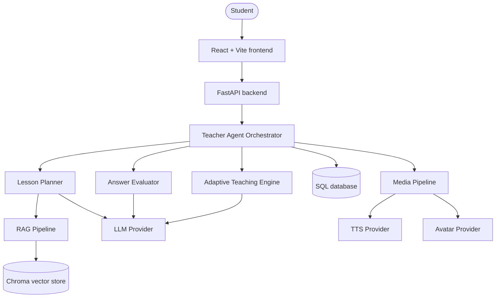
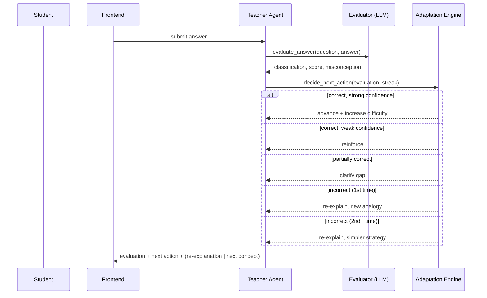
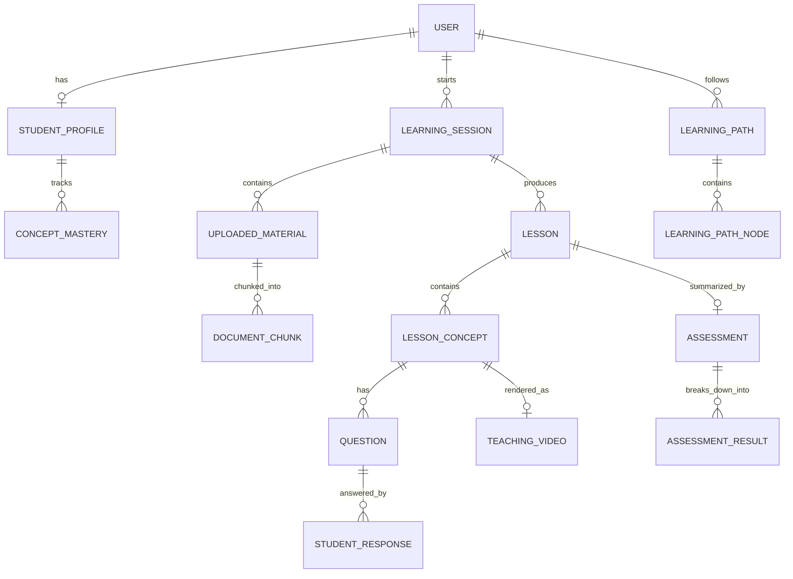
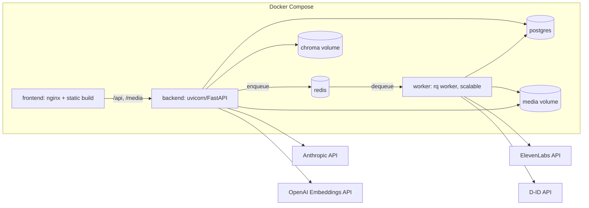
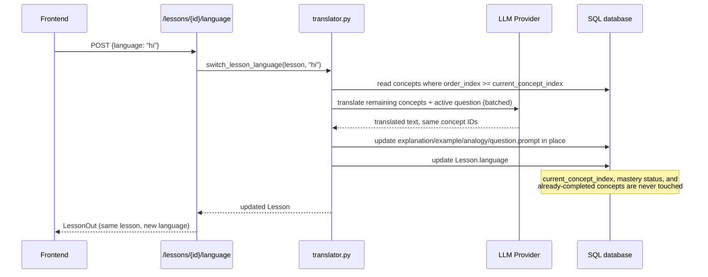

# Architecture

## System overview

## Teaching loop (per concept)

## RAG pipeline

```mermaid
flowchart LR
    Upload[Upload PDF/DOCX/PPTX] --> Validate
    Validate --> Extract[Text extraction + structure detection]
    Extract -->|text layer too thin| OCR[OCR fallback: pdf2image + tesseract]
    OCR --> Clean
    Extract --> Clean[Cleaning]
    Clean --> Chunk[Chunking + metadata]
    Chunk --> Embed[Embeddings]
    Embed --> Store[(Chroma per-material collection)]
    Query[Teaching query] --> Rewrite[Query rewriting]
    Rewrite --> Search[Vector search: top_k x 3 candidates]
    Store --> Search
    Search --> Rerank[Reranker: lexical overlap, or LLM opt-in]
    Rerank --> Assemble[Context assembly + citations, top_k]
    Assemble --> LessonLLM[LLM: grounded lesson content]
```

## Database (key relationships)

## Deployment architecture

Document ingestion and media generation (voice/avatar) run in the `worker`
service via Redis Queue (`JOB_QUEUE_BACKEND=rq`, set automatically by
`docker-compose.yml`), not in the API process — see `backend/jobs/queue.py`.
Scale workers independently under load: `docker compose up --scale worker=3`.
Local dev without Docker uses `JOB_QUEUE_BACKEND=inprocess` (FastAPI
`BackgroundTasks`) by default, needing no Redis at all.

Schema changes go through Alembic (`backend/alembic/`) in this deployment —
the backend container runs `alembic upgrade head` before starting uvicorn
(see `backend/Dockerfile`'s `CMD`), and `worker` waits on the backend's
healthcheck so it never processes jobs against an unmigrated schema. Local
SQLite dev uses `Base.metadata.create_all()` instead (simpler for that
zero-setup case).

See `docs/self_hosted_media.md` for the GPU self-hosted alternative to the
last two external calls.

## Mid-lesson language switching

